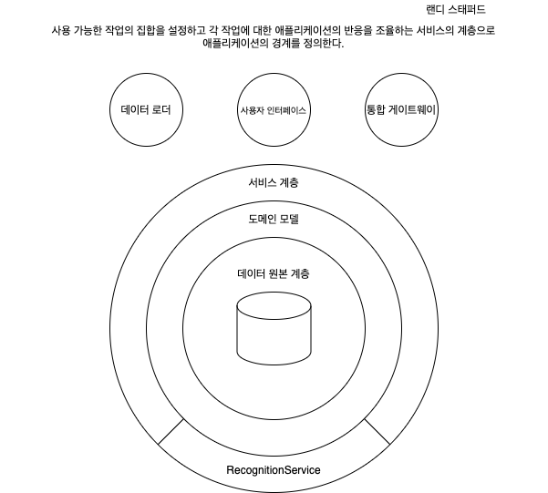
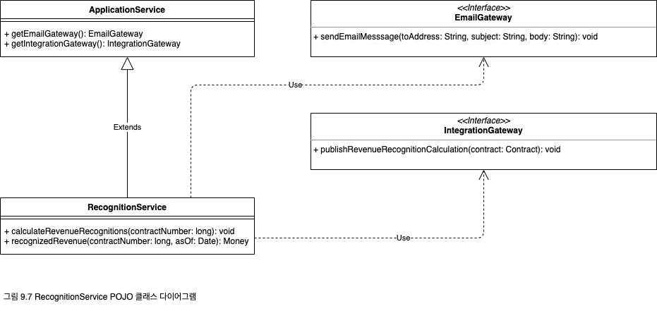
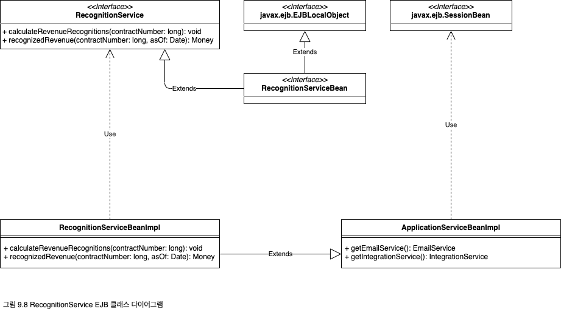

## 서비스 계층(Service Layer)

<p align="center">
  
</p>

일반적으로 엔터프라이즈 애플리케이션은 저장하는 데이터와 구현하는 논리에 대한 다양한 인터페이스를 필요로 한다. 이러한 인터페이스에는 데이터 로더, 사용자 인터페이스, 통합 게이트웨이 등이 있다. 이러한 인터페이스는 용도는 서로 다르지만 데이터에 접근 및 조작하고 비즈니스 논리를 호출하기 위해 애플리케이션과의 상호작용을 공통으로 필요로 한다. 상호작용은 여러 리소스에 걸친 트랜잭션과 수행할 여러 응답의 조율을 포함하는 복잡한 작업일 수 있다. 상호작용의 논리를 각 인터페이스에서 별도로 인코딩하면 중복이 많이 발생한다.

서비스 계층(Service Layer)은 클라이언트 계층을 인터페이스하는 관점에서 애플리케이션의 경계와 사용 가능한 작업의 집합을 정의한다. 서비스 계층은 작업을 구현할 때 트랜잭션을 제어하며 응답을 조율하면서 애플리케이션의 비즈니스 논리를 캡슐화한다.

### 작동 원리

서비스 계층은 앞서 언급한 특성을 위반하지 않으면서 몇 가지 다른 방법으로 구현할 수 있다. 차이점은 서비스 계층 인터페이스 배후의 역할 할당에서 나타난다. 구현의 다양한 가능성을 설명하기 전에 몇 가지 기본 사항을 정리해보자.

일종의 "비즈니스 논리": 서비스 계층은 [트랜잭션 스크립트](https://github.com/wonder13662/pattern-of-enterprise-application-architecture/tree/main/pattern/transaction-script)나 [도메인 모델](https://github.com/wonder13662/pattern-of-enterprise-application-architecture/tree/main/pattern/domain-model)과 마찬자기로 비즈니스 논리를 구현하기 위한 패턴이다. 필자를 비롯한 다수의 설계자는 "비즈니스 논리"를 "도메인 논리"와 "애플리케이션 논리"로 나누기를 좋아한다. 도메인 논리는 순수하게 문제 도메인(예: 계약의 수익 인식을 계산하는 전략)을 집중적으로 처리하며, 애플리케이션 논리는 애플리케이션 역할[Writing Effective Use Cases](https://www.amazon.com/Writing-Effective-Cases-Software-Development-ebook-dp-B00I077Z1M/dp/B00I077Z1M/ref=mt_other?_encoding=UTF8&me=&qid=1614416300)(예: 계산된 수익 인식을 계약 관리자와 통합된 애플리케이션에 알림)을 처리한다. 애플리케이션 논리는 종종 "워크플로 논리"라고도 하는데, "워크플로"를 다른 의미로 해석하는 사람들도 있다.

[도메인 모델](https://github.com/wonder13662/pattern-of-enterprise-application-architecture/tree/main/pattern/domain-model)은 전통적인 디자인 패턴을 사용해 복잡성을 관리하고 도메인 논리 중복을 예방한다는 면에서 [트랜잭션 스크립트](https://github.com/wonder13662/pattern-of-enterprise-application-architecture/tree/main/pattern/transaction-script)보다 나은 방법이다. 그런데 애플리케이션 논리를 순수 도메인 객체 클래스에 넣으면 두 가지 부작용이 있다.

1. 도메인 객체 클래스가 특정 애플리케이션에서 재사용하기 어려워진다.
2. 두 가지 종류의 논리를 동일한 클래스에 넣으면 다시 구현하기 어렵다. 예를 들어 나중에 애플리케이션 논리를 워크플로 툴로 분리할 필요가 있을 때 다시 구현하기 어렵다.

이러한 이유로 서비스 계층은 각 유형의 비즈니스 논리를 별도의 계층으로 분리함으로써 계층화의 일반적인 장점을 제공하고 순수 도메인 객체 클래스를 애플리케이션 간에 재사용하기 쉽게 만들어준다.

구현의 변형: 구현의 기본적인 두 가지 변형으로 도메인 파사드(domain facade) 방식과 작업 스크립트(operation script) 방식이 있다. 도메인 파사드 방식에서는 서비스 계층을 [도메인 모델](https://github.com/wonder13662/pattern-of-enterprise-application-architecture/tree/main/pattern/domain-model) 위에서 씬(Thin) 파사드의 집합으로 구현한다. 파사드를 구현하는 클래스는 비즈니스 논리를 전혀 구현하지 않으며, [도메인 모델](https://github.com/wonder13662/pattern-of-enterprise-application-architecture/tree/main/pattern/domain-model)이 모든 비즈니스 논리를 구현한다. 씬(Thin) 파사드는 클라이언트 계층이 애플리케이션과 상호작용하기 위한 작업 집합과 경계를 형성하며 서비스 계층의 근본적인 특성을 나타낸다.

작업 스크립트 방식에서는 서비스 계층을 리치 클래스 집합으로 구현한다. 이러한 클래스 집합은 애플리케이션 논리는 직접 구현하지만, 도메인 논리는 캡슐화된 도메인 객체 클래스로 위임한다. 서비스 계층의 클라이언트에 제공되는 작업은 여러 스크립트로 구현되며, 이러한 스크립트는 연관된 논리의 특정 주제 영역을 정의하는 한 클래스에 포함된다. 이러한 각 클래스는 애플리케이션 "서비스"를 형성하며 서비스 형식의 이름이 "서비스"로 끝나는 경우도 흔하다. 서비스 계층은 이러한 여러 애플리케이션 서비스 클래스로 이뤄지며, 이러한 서비스 클래스는 각자의 역할과 공통 동작을 추상화하고 [계층 상위 형식]()을 확장해야 한다.

원격 호출에 대한 고려: 서비스 계층 클래스의 인터페이스는 클라이언트 계층에 제공되는 애플리케이션 작업의 집합을 선언하므로 기본 정의상 거의 굵은 입자 인터페이스이다. 따라서 서비스 계층 클래스는 인터페이스 세분성(interface granularity)의 관점에서 보면 원격 호출에 적합하다.

그러나 원격 호출은 먼저 객체 분산이라는 비용을 치러야 사용할 수 있다. 서비스 계층 메서드 시그니처를 [데이터 전송 객체]()를 받게 변경하려면 상당히 부담스러운 추가 작업을 해야 할 수 있다. 특히 [도메인 모델](https://github.com/wonder13662/pattern-of-enterprise-application-architecture/tree/main/pattern/domain-model)이 복잡하고 복잡한 업데이트를 위한 리치 편집 UI를 사용하는 경우에는 이 추가 작업을 절대 과소평가해서는 안 된다. 상당히 힘들고 고통스러운 과정이며 아마도 객체-관계형 매핑 다음으로 힘든 작업일 것이다. [분산 객체 설계의 첫 번째 규칙]()을 기억하자.

우선은 로컬로 호출할 수 있고 도메인 객체를 받는 메서드 시그니처를 사용하는 서비스 계층으로 시작하는 것이 좋다. 원격이 꼭 필요할 때는 서비스 계층에 [원격 파사드]()를 넣거나 아니면 서비스 계층 객체에서 원격 인터페이스를 구현하면 된다. 애플리케이션에 웹 기반 UI나 웹 서비스 기반 통합 게이트웨이가 있는 경우, 비즈니스 논리를 서버 페이지나 웹 서비스와 별도의 프로세스로 실행해야 한다는 법은 없다. 실제로 같은 장소에 배치하는 방식으로도 확장성을 저해하지 않고 상당한 수준의 개발 시간을 줄이고 런타임 응답 시간을 개선할 수 있다.

**서비스 및 작업 식별**: 서비스 계층 경계에 필요한 작업을 식별하는 과정은 아주 간단하다. 이러한 작업은 서비스 계층 클라이언트의 필요성에 의해 결정되는데, 가장 중요하고 우선적인 서비스 계층 클라이언트는 일반적으로 사용자 인터페이스다. 사용자 인터페이스는 사용자가 애플리케이션으로 수행하려는 유스 케이스를 지원하도록 설계되므로 서비스 계층 작업을 식별하는 시작점은 애플리케이션의 유스 케이스 모델과 사용자 인터페이스 설계다.

엔터프라이즈 애플리케이션의 유스 케이스는 도메인 객체를 대상으로 하는 조금 지루한 "CRUD"(생성, 읽기, 갱신, 삭제) 유스 케이스인 경우가 많다. 즉, 도메인 객체를 만들고 이러한 객체의 컬렉션을 읽거나 업데이트하는 작업이다. 필자의 경험에 비춰보면 CRUD 유스 케이스와 서비스 계층 작업 간에는 거의 항상 일대일 대응 관계가 있다.

반면 이러한 유스 케이스를 실행해야 하는 애플리케이션의 역할은 전혀 지루하지 않다. 유효성 검사는 물론이고, 애플리케이션에서 도메인 객체를 생성, 업데이트, 삭제할 때 다른 사람이나 다른 통합된 애플리케이션에 알려야 하는 경우가 증가했다. 이러한 응답은 서비스 계층 작업에 의해 조율되고 트랜잭션을 통해 원자성을 유지해야 한다.

서비스 계층 추상화를 식별해 관련 작업을 그룹화하는 것을 직관적으로 할 수 있으면 정말 좋겠지만 이 영역에 대해서는 체험적 조언만 있을 뿐 확실한 처방전은 없다. 아주 간단한 애플리케이션인 경우에는 애플리케이션 이름을 그대로 딴 추상화 하나를 사용해도 충분할 것이다. 필자의 경험에 비춰보면 대규모 애플리케이션은 각각 아키텍쳐 계층의 스택을 가로지르는 완전한 수직 슬라이스를 포함하는 여러 "하위 시스템"으로 분할된다. 이 경우 필자는 하위 시스템당 하나씩 하위 시스템의 이름을 딴 추상화를 선호한다. 다른 방식으로는 도메인 모델의 주요 분할을 반영하는 추상화가 있다. 예를 들어, 하위 시스템 분할과 다른 경우(예: ContractService, ProductService), 그리고 추상화의 이름이 애플리케이션 동작을 반영하는 경우(예: RecognitionService)가 있다.

### 자바구현
서비스 계층 클래스는 도메인 파사드 방식과 작업 스크립트 방식에서 모두 POJO나 상태 비저장 세션으로 구현할 수 있다. POJO는 EJB 컨테이너에 배포하지 않아도 실행할 수 있으므로 테스트하기는 쉬울 수 있다. 대신 POJO 서비스 계층은 분산된 켄테이너 관리 트랜잭션 서비스에 연결하기 어려울 수 있으며, 특히 서비스 간 호출이 필요할 때는 더 어렵다. 반면 EJB는 컨테이너 관리 분산 트랜잭션이 기본적으로 제공되지만 테스트와 실행을 위해 컨테이너에 배포해야 한다. 각자 상황에 더 적절한 방법을 선택하면 된다.

필자가 J2EE 상에서 서비스 계층을 만들 때 선호하는 방법은 EJB 2.0 상태 비저장 세션 빈과 로컬 인터페이스를 사용하고 작업 스크립트 방식으로 POJO 도메인 객체 클래스에 위임하는 것이다. EJB가 분산된 컨테이너 관리 트랜잭션을 제공하기 때문에 상태 비저장 세션 빈으로 서비스 계층을 구현하면 아주 편리하다. 또한 EJB 2.0에 추가된 로컬 인터페이스를 사용하면 까다로운 객체 분산 문제를 예방하면서 유용한 트랜잭션 서비스를 마음껏 활용할 수 있다.

또한 자바 관련 내용으로서, 서비스 계층과 J2EE 패턴 서적[Alur et al.]() 및 [Marinescu]()에 나온 세션 파사드 패턴과의 차이를 명확하게 해둘 필요가 있다. 세션 파사드는 엔터티 빈에 원격 호출이 너무 많을 때 성능 저하를 방지하는 방법으로 고안됐다. 따라서 세션 빈을 엔터티 빈의 파사드로 사용하는 처방을 내렸다. 반면 서비스 계층은 역할을 팩터링으로 분리해 중복을 방지하고 재사용성을 향상하기 위해 만들어졌으며, 특정 기술에 얽매이지 않는 아키텍쳐 패턴이다. 실제로 서비스 계층에 영감을 제공한 애플리케이션 경계 패턴[Cockburn PloP]()은 EJB보다 3년 전에 나왔다. 세션 파사드는 서비스 계층과 비슷하다고 할 수 있지만, 현재의 명칭이나 범위, 그리고 사용하는 용도를 감안하면 둘은 분명히 다르다.

### 사용 시점
서비스 계층의 장점은 여러 종류의 클라이언트에 제공하는 애플리케이션 작업의 공통적인 집합을 정의하고 각 작업에 대한 애플리케이션의 응답을 조율한다는 것이다. 이러한 응답에는 여러 트랜잭션 리소스에 걸쳐 원자성을 유지해야 하는 애플리케이션 논리가 포함될 수 있다. 따라서 애플리케이션에 비즈니스 논리를 사용하는 클라이언트 종류가 둘 이상이고, 유스 케이스의 복잡한 응답에 여러 트랜잭션 리소스가 포함되는 경우, 분산되지 않는 아키텍쳐라도 컨테이너 관리 트랜잭션과 함께 서비스 계층을 활용하는 것이 합리적이다.

사용할 필요가 없는 경우를 묻는 질문에는 대답하기가 좀 더 쉽다. 애플리케이션에 비즈니스 논리를 사용하는 클라이언트가 한 종류(예: 사용자 인터페이스)밖에 없고 이 유스 케이스 응답에 여러 트랜잭션 리소스가 포함되지 않는 경우에는 서비스 계층이 필요 없을 것이다. 이 경우 페이지 컨트롤러를 사용해 트랜잭션을 수동으로 제어하고, 필요한 응답을 조율하며, 필요에 따라 데이터 원본 계층으로 직접 위임할 수 있다.

그러나 나중에라도 두 번째 종류의 클라이언트를 구상하거나 유스 케이스 응답에 두 번째 트랜잭션 리소스를 추가하는 경우를 감안하면 처음부터 서비스 계층을 설계하는 것이 좋을 수 있다.

### 참고 자료
서비스 계층에 영감을 준 패턴은 알리스테어 콕번(Alistair Cockburn)의 애플리케이션 경계 패턴[Cockburn PloP]()이며, 이에 해당하는 선행 기술은 그리 많지 않다. 원격 서비스라는 맥락[Alpert et al.](https://www.amazon.com/Patterns-Smalltalk-Companion-Hardcover-1998-Software/dp/B000MU2JSO/ref=sr_1_1?dchild=1&keywords=Design+patterns+smalltalk+companion&qid=1615159024&sr=8-1)에서는 분산 시스템에서 파사드의 역할을 설명한다. 이 내용과 세션 파사드에 대한 맥락[Alur et al.]()에서는 분산 시스템에서 파사드의 역할을 설명한다. 이 내용과 세션 파사드에 대한 [Alpert et al.](https://www.amazon.com/Patterns-Smalltalk-Companion-Hardcover-1998-Software/dp/B000MU2JSO/ref=sr_1_1?dchild=1&keywords=Design+patterns+smalltalk+companion&qid=1615159024&sr=8-1)과 [Marinescu](https://www.amazon.com/EJB-Design-Patterns-Advanced-Processes/dp/0471208310/ref=sr_1_1?dchild=1&keywords=ejb+design+patterns+marinescu&qid=1615158012&sr=8-1)의 다양한 프레젠테이션을 비교 및 대조하면 큰 도움이 될 것이다. 서비스 계층 작업 내에서 조율해야 하는 애플리케이션 역할이라는 주제에 관해서는 동작의 계약[Cockburn UC]()이라는 유스 케이스에 대한 콕번의 설명이 아주 유용하다. "시스템 작업"[Coleman et al.](https://www.amazon.com/Object-Oriented-Development-Fusion-Derek-Coleman/dp/0133388239/ref=sr_1_1?dchild=1&keywords=Object-Oriented+Development%3A+The+Fusion+Method&qid=1615159949&sr=8-1)에 대한 퓨전 방법론(Fusion methodology)의 관점도 알아두자.

### 예제: 수익 인식(자바)
이 예제는 [트랜잭션 스크립트](https://github.com/wonder13662/pattern-of-enterprise-application-architecture/tree/main/pattern/transaction-script)와 [도메인 모델](https://github.com/wonder13662/pattern-of-enterprise-application-architecture/tree/main/pattern/domain-model) 패턴의 수익 인식 예제에 이어서 서비스 계층을 이용해 애플리케이션 논리를 스크립트하는 방법과 서비스 계층 작업에서 도메인 논리를 위임하는 방법을 알아본다. 이 예제는 작업 스크립트 방식으로 서비스 계층을 구현하며, 먼저 [POJO](https://ko.wikipedia.org/wiki/Plain_Old_Java_Object)를 사용하고 그 다음 [EJB](https://ko.wikipedia.org/wiki/%EC%97%94%ED%84%B0%ED%94%84%EB%9D%BC%EC%9D%B4%EC%A6%88_%EC%9E%90%EB%B0%94%EB%B9%88%EC%A6%88)를 사용한다.

설명을 위해 약간의 애플리케이션 논리를 포함하도록 시나리오를 확장했다. 애플리케이션에 추가된 유스케이스 요건에서는 이제 계약의 수익 인식이 계산되면 이벤트에 대한 이메일 알림을 지정된 계약 관리자에게 전송하고 메시지 기반 미들웨어를 사용해 다른 통합된 애플리케이션에 메시지를 게시해야 한다고 가정하자.

먼저 [트랜잭션 스크립트](https://github.com/wonder13662/pattern-of-enterprise-application-architecture/tree/main/pattern/transaction-script) 예제에 나온 `RegocnitionService` 클래스를 수정해 [계층 상위 형식]()을 확장하고 [게이트웨이]() 두 개를 사용해 애플리케이션 논리를 수행하게 한다. 그러면 클래스 구조가 그림 9.7의 클래스 다이어그램과 같아진다. `RegocnitionService`는 서비스 계층 애플리케이션 서비스의 POJO 구현이며 여기에 포함된 메서드는 애플리케이션의 경계에서 사용 가능한 작업 두 개를 나타낸다.

`RegocnitionService` 클래스의 메서드는 작업의 애플리케이션 논리를 스크립팅하고 도메인 논리는 도메인 객체 클래스([도메인 모델](https://github.com/wonder13662/pattern-of-enterprise-application-architecture/tree/main/pattern/domain-model)의 예제 참고)로 위임한다.

```java
public class ApplicationService {
  protected EmailGateway getEmailGateway() {
    // EmailGateway의 인스턴스 반환
  }

  protected IntegrationGateway getIntegrationGateway() {
    // IntegrationGateway 반환
  }
}

public interface EmailGateway {
  void sendEmailMessage(String toAddress, String subject, String body);
}

public interface IntegrationGateway {
  void publishRevenueRecognitionCalculation(Contract contract);
}

public class RecognitionService extends ApplicationService {
  public void calculateRevenueRecognitions(long contractNumber) {
    Contract contract = Contract.readForUpdate(contractNumber);
    contract.calculateRecognitions();
    getEmailGateway().sendEmailMessage(
      contract.getAdminstratorEmailAddress(),
      "RE: Contract #" + contractNumber,
      contract + " has had revenue recognitions calculated."
    );
    getIntegrationGateway().publishRevenueRecognitionCalculation(contract);
  }

  public Money recognizedRevenue(long contractNumber, Date asOf) {
    return Contract.read(contractNumber).recognizedRevenue(asOf);
  }
}
```

<p align="center">
  
</p>

지속성과 관련된 세부 사항은 예제에서 다루지 않았다. `Contract` 클래스가 데이터 원본 계층에서 번호를 기준으로 계약서를 읽는 정적 메서드를 구현한다고 알아두면 충분하다. 이 메서드 중 하나에는 읽은 계약을 업데이트하려는 의도가 이름에 나타난다. 읽은 객체는 [데이터 매퍼]()가 [작업 단위]() 같은 것을 이용해 등록할 수 있다.

트랜잭션과 관련된 세부 사항도 예제에서 다루지 않았다. `calculateRevenueRecognitions()` 메서드를 실행하는 동안 수익 인식을 추가해 지속적으로 계약 객체를 수정하고, 메시지를 메시지 기반 미들웨어의 대기열에 추가하며, 이메일도 전송하므로 근본적으로 트랜잭션으로 처리돼야 한다. 계약에 대한 변경 사항을 저장하지 못하는 경우에는 이메일을 전송하거나 메시지를 게시하지 않아야 하므로 이러한 모든 응답은 트랜잭션을 통해 원자성을 유지해야 한다.

J2EE 플랫폼에서는 애플리케이션 서비스(및 [게이트웨이]())를 트랜잭션 리소스를 사용하는 상태 비저장 세션 빈으로 구현해 EJB 컨테이너가 분산 트랜잭션을 관리하게 할 수 있다. 그림 9.8에는 EJB 2.0 로컬 인터페이스와 "비즈니스 인터페이스" 관용구를 사용하는 `RecognitionService` 구현의 클래스 다이어그램이 나온다. 이 구현에서도 [계층 상위 형식]()이 여전히 사용되며, EJB가 요구하는 빈 구현 클래스 메서드의 기본 구현과 특정 애플리케이션 메서드를 제공한다. `EmailGateway`와 `IntegrationGateway` 인터페이스도 그에 해당하는 상태 비저장 세션 빈의 "비즈니스 인터페이스"라고 가정하면 분산된 트랜잭션의 제어는 `calculateRevenueRecognitions`, `sendEmailMessage`, `publishRevenueRecognitionCalculation` 메서드에 트랜잭션을 적용한다고 선언하는 방법으로 해결할 수 있다. [POJO](https://ko.wikipedia.org/wiki/Plain_Old_Java_Object) 예제에 있던 `RecognitionService` 메서드는 수정되지 않고 `RecognitionServiceBeanImpl`로 옮겼다.

<p align="center">
  
</p>

이 예제에서 중요한 점은 서비스 계층이 작업의 트랜잭션 응답을 조율하는 데 작업 스크립팅과 도메인 객체 클래스를 모두 사용한다는 것이다. `calculateRevenueRecognitions` 메서드는 애플리케이션의 유스 케이스에서 요구되는 응답의 애플리케이션 논리를 스크립팅하지만 도메인 논리는 도메인 객체 클래스로 위임한다. 또한 서비스 계층의 작업 스크립트 내에서 논리가 중복되지 않게 방지하는 두 가지 기법을 보여준다. 역할은 위임을 통해 재사용할 수 있게 팩터링을 거쳐 다른 객체(예: [게이트웨이]())로 분리됐다. [계층 상위 형식]()은 이러한 다른 객체에 편리하게 접근할 수 있게 해준다. 관찰자[Gang of Four](https://www.amazon.com/Design-Patterns-Elements-Reusable-Object-Oriented/dp/0201633612/ref=sr_1_2?dchild=1&keywords=gang+of+four&qid=1615597756&sr=8-2) 패턴을 사용하면 작업 스크립트를 더 세련되게 구현할 수 있다고 주장하는 사람들도 있지만, 관찰자는 상태 비저장 다중 스레드 서비스 계층에서는 구현하기 어렵다. 필자는 작업 스크립트를 통한 개방적인 코드가 더 명확하고 간단하다고 생각한다.

어떤 사람들은 애플리케이션 논리 역할을 도메인 객체 메서드에 구현(예: `Contract.calculateRevenueRecognitions()`)하거나 심지어 데이터 원본 계층에 구현하면 별도의 서비스 계층을 만들 필요가 없다고 주장하기도 한다. 그러나 역할을 이와 같이 할당하는 방법은 몇 가지 이유로 권장되지 않는다.

1. 도메인 객체 클래스가 특정 애플리케이션의 논리를 구현하면 여러 애플리케이션에서 재사용하기 어려워진다.(특정 애플리케이션의 [게이트웨이]()를 사용하는 경우도 마찬가지). 도메인 객체 클래스는 애플리케이션의 유스 케이스 역할을 모두 다루는 것이 아니라 애플리케이션의 관심사에 해당하는 문제 도메인의 일부를 모델링해야 한다.
2. 애플리케이션 논리를 전용 목적의 "상위" 계층(물론, 데이터 원본 계층은 아님)에 캡슐화하면 해당 계층의 구현을 변경하기가 용이하다.(예: 워크플로 엔진을 사용하도록 변경).

서비스 계층은 엔터프라이즈 애플리케이션의 논리 계층을 체계화하기 위한 패턴으로서, 스크립팅과 도메인 객체 클래스를 결합하고 둘의 장점을 활용하게 해준다. 서비스 계층 구현에는 도메인 파사드나 작업 스크립트, [POJO](https://ko.wikipedia.org/wiki/Plain_Old_Java_Object) 세션 빈 또는 둘의 조합과 같은 여러 변형이 있다. 또한 서비스 계층은 로컬 호출이나 원격 호출 또는 두 가지가 모두 가능하게 설계할 수 있다. 이 패턴의 핵심은 어떠한 변형을 사용하든지 관계없이 애플리케이션의 비즈니스 논리의 구현을 캡슐화하고 이러한 논리를 다양한 클라이언트가 일관성 있게 호출할 수 있게 기반을 마련한다는 것이다.


