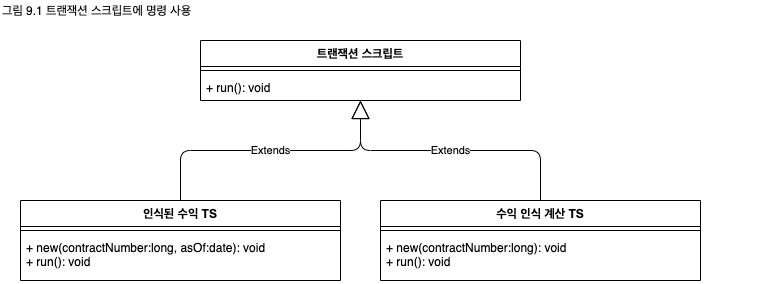
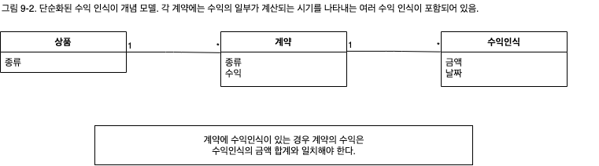

## 트랜잭션 스크립트
비즈니스 논리를 프로시저별로 구성해 각 프로시저가 프레젠테이션의 단일 요청을 처리하게 한다.
<p align="center">
  
</p>

대부분의 비즈니스 애플리케이션은 일련의 트랜잭션으로 이뤄진다. 트랜잭션으로 정보를 특정한 방법으로 정리해서 보여주거나 정보를 변경하는 등의 작업을 할 수 있다. 클라이언트 시스템과 서버 시스템 간의 각 상호작용에는 일정한 양의 논리가 포함된다. 이러한 논리는 데이터베이스에서 가져온 정보를 표시하는 간단한 것일 수도 있고 유효성 감사와 계산을 포함한 여러 단계의 작업일 수도 있다.

트랜잭션 스크립트(Transaction Script)는 이 모든 논리를 단일 프로시저로 구성하고 데이터베이스를 직접 또는 씬 데이터베이스 래퍼를 통해서 호출한다. 각 트랜잭션은 자체 트랜잭션 스크립트로 실행되지만, 공통적인 하위 작업은 하위 프로시저로 분할할 수 있다.

### 작동 원리
트랜잭션 스크립트를 사용하는 경우 도메인 논리는 주로 시스템에 대해 수행하는 트랜잭션으로 구성된다. 예를 들어, 호텔 객실을 예약하는 경우 빈 객실 확인, 요금 계산, 데이터베이스 업데이트 등을 수행하는 논리는 호텔 객실 예약이라는 프로젝트 안에 포함된다.

간단한 경우의 구성 방법에 대해서는 사실 더 설명할 필요가 없을 정도다. 물론 다른 프로그램을 작성할 때와 마찬가지로 합리적인 방식으로 코드를 모듈화해야 한다. 트랜잭션이 특별히 복잡한 경우가 아니면 그리 어려운 일은 아니다. 이 방식의 장점 중 하나는 다른 트랜잭션에서 하는 일에 대해 신경 쓸 필요가 없다는 것이다. 입력을 받고, 데이터베이스에서 정보를 얻고, 필요한 작업을 한 후, 결과를 데이터베이스에 저장하면 된다.

트랜잭션 스크립트를 넣는 위치는 계층을 구성하는 방법에 따라 다른데, 서버 페이지, CGI 스크립트 또는 분산된 세션 객체에 넣을 수 있다. 트랜잭션 스크립트는 최대한 분리하는 것이 바람직하다. 적어도 별도의 서브루틴에 넣어야 하며, 프레젠테이션과 데이터 원본을 처리하는 클래스와는 다른 클래스에 넣는 것이 좋다. 또한 트랜잭션 스크립트에는 프레젠테이션 논리에 대한 호출을 전혀 포함하지 말아야 한다. 이렇게 하면 트랜잭션 스크립트 코드를 수정하고 테스트하기기 수월해진다.

트랜잭션 스크립트를 클래스로 구성하는 방법은 두 가지다. 가장 일반적인 방법은 여러 트랜잭션 스크립트를 한 클래스에 넣고 각 클래스에서 연관된 트랜잭션 스크립트의 주제 영역을 정의하는 것이다. 이 방법은 직관적이고 대부분의 경우에 잘 어울린다. 다른 방법은 `명령 패턴`-[Gang of Four](https://www.amazon.com/Design-Patterns-Elements-Reusable-Object-Oriented/dp/0201633612/ref=sr_1_2?dchild=1&keywords=gang+of+four&qid=1615597756&sr=8-2)을 활용해 각 트랜잭션 스크립트를 자체 클래스에 넣는 것이다.(그림 9.1) 이 경우 명령의 상위 형식을 정의하고 여기서 트랜잭션 스크립트 논리가 포함될 일종의 실행 메서드를 지정하면 된다. 이렇게 할 때의 장점은 스크립트의 인스턴스를 런타임에 객체로써 조작할 수 있다는 것이다. 다만 트랜잭션 스크립트로 도메인 논리를 구성하는 시스템에서 이러한 기능이 필요한 경우는 거의 없다. 물론 여러 언어에서 클래스를 완전히 무시하고 전역 함수를 사용해도 된다. 그러나 새로운 객체를 인스턴스화하면 데이터를 결기하기가 좀 더 수월하므로 스레딩 문제를 해결하는 데 도움되는 경우가 많다.

이 패턴을 트랜잭션 스크립트라고 하는 이유는 대부분의 경우 각 데이터베이스 트랜잭션마다 트랜잭션 스크립트 하나가 있기 때문이다. 항상 그런 것은 아니지만 대부분의 경우에 해당된다.

### 사용 시점

트랜잭션 스크립트의 가장 큰 장점은 단순함이다. 작은 규모의 논리가 포함된 애플리케이션에서 자연스럽게 논리를 구성할 수 있는 방법이며, 코드를 실행할 때 발생하는 오버헤드가 적고 코드를 이해하기도 쉽다. 그러나 비즈니스 논리가 복잡해지면 좋은 설계 상태를 유지하기가 점차 어려워진다. 특히 문제가 되는 것은 트랜잭션 간의 코드 중복이다. 트랜잭션 스크립트의 주 목적이 트랜잭션 하나를 처리하는 것이므로 공통적인 코드가 중복되는 경향이 있다.

<p align="center">
  
</p>

세심한 팩터링으로 이러한 여러 문제를 완화할 수 있지만 더 복잡한 비즈니스 도메인을 제대로 구현하려면 [도메인 모델](https://github.com/wonder13662/pattern-of-enterprise-application-architecture/tree/main/pattern/domain-logic-pattern/domain-model)을 이용해야 한다. [도메인 모델](https://github.com/wonder13662/pattern-of-enterprise-application-architecture/tree/main/pattern/domain-logic-pattern/domain-model)은 코드를 구성하면서 가독성을 높이고 중복을 줄이기 위한 더 다양한 수단을 제공한다.

논리의 복잡도가 어느 수준 이상일 때 [도메인 모델](https://github.com/wonder13662/pattern-of-enterprise-application-architecture/tree/main/pattern/domain-logic-pattern/domain-model)이 적합하다고 정확하게 말하기는 어렵다. 특히 둘 중 한 패턴에 익숙하다면 더 미묘하다. 트랜잭션 스크립트 설계를 [도메인 모델](https://github.com/wonder13662/pattern-of-enterprise-application-architecture/tree/main/pattern/domain-logic-pattern/domain-model)설계로 리팩터링하는 것도 가능하지만, 필요 이상으로 어렵다. 따라서 리팩터링보다는 처움부터 [도메인 모델](https://github.com/wonder13662/pattern-of-enterprise-application-architecture/tree/main/pattern/domain-logic-pattern/domain-model)로 설계하는 것이 유리하다.

그러나 객체 신봉자라도 트랜잭션 스크립트를 처음부터 배제하는 것은 현명하지 않다. 우리가 해결해야 하는 문제 중에는 단순한 문제도 상당히 많으며, 단순한 문제는 단순한 해결책으로 훨씬 빨리 해결할 수 있다.

### 수익 인식 문제
이 패턴을 비롯해 도메인 논리에 대한 이후 설명에서는 동일한 문제를 예제로 활용한다. 똑같은 문제를 여러 번 반복해서 설명하지 않기 위해 여기서 그 문제를 소개한다.

수익 인식은 비즈니스 시스템의 공통적인 문제다. 기본적으로 이 문제는 수익을 어떤 시점에 실제로 수익으로 인정할 수 있느냐에 대한 것이다. 예를 들어, 커피를 파는 경우에는 이 문제가 아주 간단하다. 손님에게 커피를 건네고 돈을 받으면 바로 그 순간 커피 값을 수익으로 계산할 수 있다. 그런데 이보다 상황이 복잡한 경우가 많다. 예를 들어, 내년 한 해 동안 컨설팅을 위한 상담료를 지불한다고 가정해보자. 상당히 많은 액수의 상담료가 바로 오늘 지불되지만 일 년 동안 꾸준하게 서비스를 제공해야 하므로 전체 상담료를 당장 수익으로 기록할 수는 없다. 한 가지 방법은 매월 상담료의 1/12에 해당하는 금액을 수익으로 계산하는 것이다. 이렇게 하면 한 달뒤 상담 서비스가 마음에 들지 않은 고객이 나머지 계약을 취소하더라도 수익을 계산하기 쉽다.

수익 인식의 규칙은 매우 다양하고 변힝이 많다. 법률이나 분야별 표준에 따라 정해지기도 하고 회사 정책에 따라 정해지기도 한다. 결과적으로 수익 관리는 아주 복잡한 문제가 된다.

여기서는 복잡한 내용을 글로 설명하기 보다는 세 가지 상품(워드프로세서, 데이터베이스, 스프레드시트)을 판매하는 가상의 회사를 예로 알아보자. 이 회사에서는 워드프로세서를 판매하면 모든 수익을 즉시 계산한다. 스프레드시트를 판매하면 수익의 1/3을 즉시, 1/3을 60일 후, 그리고 남은 1/3을 90일 후 계산한다. 그리고 데이터베이스를 판매하면 1/3을 즉시, 1/3을 30일 후, 그리고 남은 1/3을 60일 후에 계산한다. 이러한 규칙은 당연히 실제 규칙은 아니며 필자가 마음대로 만든 것이다. 물론 실제 기업에서도 이러한 예와 같이 아주 다양한 규칙이 사용된다.

<p align="center">
  
</p>

### 예제: 수익 인식(Java)
이 예제에서는 트랜잭션 스크립트 두 개를 사용한다. 하나는 특정 계약의 수익 인식을 계산하며, 다른 하나는 특정 계약에서 특정 날짜까지 인식되는 수익을 알려준다. 데이터베이스 구조는 상품, 계약, 수익 인식을 각각 저장하는 테이블 세 개로 구성돼 있다.

```sql
CREATE TABLE products (ID int primary key, name varchar, type varchar)
CREATE TABLE contracts (ID int primary key, product int, revenue decimal, dateSigned date)
CREATE TABLE revenueRecognitions (contract int, amount decimal, recognition date, PRIMARY KEY (contract, recognizedOn))
```

첫번째 스크립트는 특정 날짜까지 인식된 총액을 계산한다. 이 작업은 수익 인식 테이블에서 해당하는 행을 선택한 다음 금액을 합하는 두 단계로 수행할 수 있다.

트랜잭션 스크립트를 설계할 때는 SQL 코드를 프로시저에 넣어 데이터베이스에 직접 작업하는 경우가 많다. 여기서는 간단한 [테이블 데이터 게이트웨이]()를 사용해 SQL 쿼리를 래핑했다.이 예제는 아주 간단하므로 게이트웨이를 테이블당 하나가 아니라 전체에서 하나만 사용했다. 그리고 적절한 검색 메서드를 게이트웨이에 정의할 수 있다.

```java
class GateWay {
  public ResultSet findRecognitionsFor(long contractID, MfDate asof) throws SQLException {
    PreparedStatement stmt = db.preparedStatement(findRecognitionStatement);
    stmt.setLong(1, contractID);
    stmt.setDate(2, asof.toSqlDate());
    ResultSet result = stmt.executeQuery();
    return result;
  }

  private static final String findRecognitionStatement =
  "SELECT amount " +
  " FROM revenueRecognitions " +
  " WHERE contract = ? AND recognizedOn <= ?";

  private Connection db;
}
```

그런 다음 게이트웨이에서 반환된 결과 집합을 바탕으로 합계를 구하는 코드를 작성한다.

```java
class RecognitionService {
  public Money recognizedRevenue(long contractNumber, MfDate asOf) {
    Money result = Money.dollars(0);
    try {
      ResultSet rs = db.findRecognitionsFor(contractNumber, asOf);
      while(rs.next()) {
        result = result.add(Money.dollars(rs.getBigDecimal("amount")));
      }
    } catch (SELExcpetion e) {
      throw new ApplicationException(e);
    }
  }
}
```

계산은 이와 같이 간단하며, 인메모리 스크립트를 집계 합수로 총액을 얻는 SQL 문 호출로 대체할 수 있다.

기존 계약의 수익 인식을 계산하는 데도 비슷한 분할 방법을 사용했다. 서비스의 스크립트는 비즈니스 논리를 수행한다.

```java
class RecognitionService {
  public void calculateRevenueRecognitions(long contractNumber) {
    try {
      ResultSet contracts = db.findContract(contractNumber);
      contracts.next();
      Money totalRevenue = Money.dollars(contracts.getBigDecimal("revenue"));
      MfDate recognitionDate = new MfDate(contracts.getDate("dateSigned"));
      String type = contracts.getString("type");
      if (type.equals("S")) { // SpreadSheet
        Money[] allocation = totalRevenue.allocate(3);
        db.insertRecognition(contractNumber, allocation[0], recognitionDate);
        db.insertRecognition(contractNumber, allocation[1], recognitionDate.addDays(60));
        db.insertRecognition(contractNumber, allocation[2], recognitionDate.addDays(90));
      } else if (type.equals("W")) { // WordProcessor
        db.insertRecognition(contractNumber, totalRevenue, recognitionDate);
      } else if (type.equals("D")) { // Database
        Money[] allocation = totalRevenue.allocate(3);
        db.insertRecognition(contractNumber, allocation[0], recognitionDate);
        db.insertRecognition(contractNumber, allocation[1], recognitionDate.addDays(30));
        db.insertRecognition(contractNumber, allocation[2], recognitionDate.addDays(60));
      }
    } catch (SQLException e) {
      throw new ApplicationExpcetion(e);
    }
  }
}
```

할당하는 데 [금액]()을 사용했다는 데 주의하자. 금액을 여러 개로 분할하다 보면 잔돈을 잃어버리기 쉽다.

[테이블 데이터 게이트웨이]()는 SQL에 대한 지원 기능을 제공한다. 먼저 계약을 검색하는 메서드다.

```java
class Gateway {
  public ResultSet findContract(long contractID) throws SQLException {
    PreparedStatement stmt = db.preparedStatement(findContractStatement);
    stmt.setLong(1, contractID);
    ResultSet result = stmt.executeQuery();
    return result;
  }

  private static final String findContractStatement =
    "SELECT * " +
    " FROM contracts c, products p " +
    " WHERE ID = ? AND c.product = p.ID ";
}
```

두번째는 삽입을 위한 래퍼다.

```java
class Gateway {
  public void insertRecognition (long contractID, Money amount, MfDate asof) throws SQLException {
    PreparedStatement stmt = db.preparedStatement(insertRecognitionStatement);
    stmt.setLong(1, contractID);
    stmt.setBigDecimal(2, amount.amount());
    stmt.setDate(3, asof.toSqlDate());
    stmt.executeUpdate();
  }

  private static final String insertRecognitionStatement =
    "INSERT INTO revenueRecognitions VALUES (?, ?, ?)";
}
```

자바 시스템에서 인식 서비스는 일반 클래스나 세션 빈일 수 있다.

이 예제를 [도메인 모델](https://github.com/wonder13662/pattern-of-enterprise-application-architecture/tree/main/pattern/domain-logic-pattern/domain-model)의 예제와 비교해보면 사고방식이 아주 특이하지 않은 이상 이 예제가 훨씬 간단하다는데 동의할 것이다. 트랜잭션 스크립트의 문제는 규칙이 더 복잡해지면 해결하는 방법을 찾기 어렵다는 것이다. 일반적인 수익 인식 규칙은 매우 복잡해서 상품의 종류만이 아니라 날짜에 따라서도 달라질 수 있다(예: 4월 15일 이전 계약에 ... 규칙을 적용). 이렇게 규칙이 복잡해지면 트랜잭션 스크립트로는 일관된 설계를 유지하기가 어렵다. 필자를 비롯한 객체 신봉자가 이런 상황에 [도메인 모델](https://github.com/wonder13662/pattern-of-enterprise-application-architecture/tree/main/pattern/domain-logic-pattern/domain-model)을 선호하는 것은 이 때문이다.
