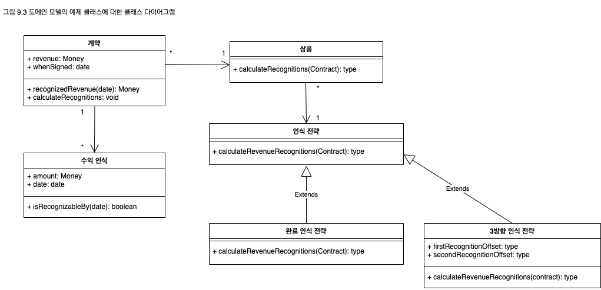

<p align="center">
  
</p>
### RevenueRecognition.java
```java
class RevenueRecognition {
  private Money amount;
  private MfDate date;

  public RevenueRecognition(Money amount, MfDate date) {
    this.amount = amount;
    this.date = date;
  }

  public Money getAmount() {
    return amount;
  }

  boolean isRecognizableBy(MfDate asOf) {
    return asOf.after(date) || asOf.equals(date);
  }
}
```
### Contract.java
```java
class Contract {
  private Product product;
  private Money revenue;
  private MfDate whenSigned;
  private Long id;

  private List revenueRecognitions = new ArrayList();

  public Contract(Product product, Money revenue, MfDate whenSigned) {
    this.product = product;
    this.revenue = revenue;
    this.whenSigned = whenSigned;
  }

  public Money recognizedRevenue(MfDate asOf) {
    Money result = Money.dollars(0);
    Iterator it = revenueRecognitions.iterator();
    while(it.hasNext()) {
      RevenueRecognition r = (RevenueRecognition) it.next();
      if (r.isRecognizbleBy(asOf)) {
        result = result.add(r.getAmount())
      }
    }

    return result;
  }

  public void calculateRecognitions() {
    product.calculateRevenueRecognitions(this);
  }
}
```
### Product.java
```java
class Product {
  private String name;
  private RecognitionStrategy recognitionStrategy;

  public Product(String name, RecognitionStrategy recognitionStrategy) {
    this.name = name;
    this.recognitionStrategy = recognitionStrategy;
  }

  public static Product newWordProcessor(String name) {
    return new Product(name, new CompleteRecognitionStrategy());
  }

  public static Product newSpreadsheet(String name) {
    return new Product(name, new ThreeWayRecognitionStrategy(60, 90));
  }

  public static Product newDataBase(String name) {
    return new Product(name, new ThreeWayRecognitionStrategy(30, 60));
  }

  void calculateRevenueRecognitions(Contract contract) {
    recognitionStrategy.calculateRevenueRecognitions(contract);
  }
}
```
### RecognitionStrategy.java
```java
class RecognitionStrategy {
  abstract void calculateRevenueRecognitions(Contract contract);
}
```
### CompleteRecognitionStrategy.java
```java
class CompleteRecognitionStrategy {
  void calculateRevenueRecognitions(Contract contract) {
    contract.addRevenueRecognition(new RevenueRecognition(contract.getRevenue(), contract.getWhenSigned()));
  }
}
```
### ThreeWayRecognitionStrategy.java
```java
class ThreeWayRecognitionStrategy {
  private int firstRecognitionOffset;
  private int secondRecognitionOffset;

  public ThreeWayRecognitionStrategy(int firstRecognitionOffset, int secondRecognitionOffset) {
    this.firstRecognitionOffset = firstRecognitionOffset;
    this.secondRecognitionOffset = secondRecognitionOffset;
  }

  void calculateRevenueRecognitions(Contract contract) {
    Money[] allocation = contract.getRevenue().allocate(3);
    contract.addRevenueRecognition(
      new RevenueRecognition(
        allocation[0],
        contract.getWhenSigned())
      );
    contract.addRevenueRecognition(
      new RevenueRecognition(
        allocation[1],
        contract.getWhenSigned().addDays(firstRecognitionOffset)
      )
    );
    contract.addRevenueRecognition(
      new RevenueRecognition(
        allocation[2],
        contract.getWhenSigned().addDays(secondRecognitionOffset)
      )
    );
  }
}
```
### Tester.java
```java
class Tester {
  private Product word = Product.newWordProcessor("Thinking Word");
  private Product calc = Product.newSpreadsheet("Thinking calc");
  private Product db = Product.newDataBase("Thinking DB");
}
```
