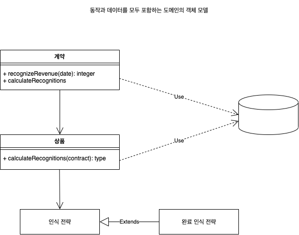

## 도메인 모델
동작과 데이터를 모두 포함하는 도메인의 객체 모델

비즈니스 논리는 경우에 따라 아주 복잡할 수 있다. 규칙과 논리는 매우 다양한 사례와 동작의 변형을 나타내며, 객체는 이러한 복잡성을 처리하기 위해 고안됐다. 도메인 모델(Domain Model)은 각 객체가 하나의 기업과 같이 복잡하거나 주문서의 내용 한 줄과 같이 같단한, 의미 있는 하나의 대상을 나타내는 상호 연결된 객체의 연결망으로 이뤄진다.

### 작동 원리
애플리케이션에서 도메인 모델을 구현하는 과정은 비즈니스 영역을 모델링하는 객체로 구성된 계층을 구성하는 과정이다. 이러한 객체 중에는 일상적인 업무에 사용되는 비즈니스 데이터로 나타내는 객체도 있고 비즈니스 규칙을 나타내는 객체도 있다. 이러한 데이터와 프로세스는 프로세스와 작업 대상 데이터를 가깝게 배치하기 위한 클러스터를 형성한다.
