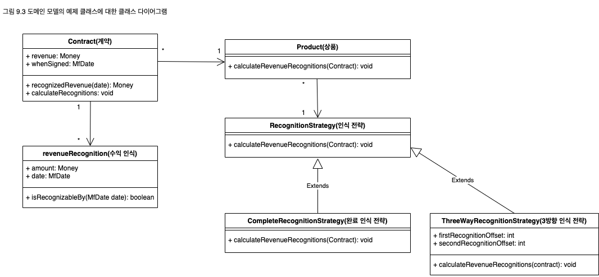

## 도메인 모델
동작과 데이터를 모두 포함하는 도메인의 객체 모델
<p align="center">
  
</p>

비즈니스 논리는 경우에 따라 아주 복잡할 수 있다. 규칙과 논리는 매우 다양한 사례와 동작의 변형을 나타내며, 객체는 이러한 복잡성을 처리하기 위해 고안됐다. 도메인 모델(Domain Model)은 각 객체가 하나의 기업과 같이 복잡하거나 주문서의 내용 한 줄과 같이 같단한, 의미 있는 하나의 대상을 나타내는 상호 연결된 객체의 연결망으로 이뤄진다.

### 작동 원리
애플리케이션에서 도메인 모델을 구현하는 과정은 비즈니스 영역을 모델링하는 객체로 구성된 계층을 구성하는 과정이다. 이러한 객체 중에는 일상적인 업무에 사용되는 비즈니스 데이터로 나타내는 객체도 있고 비즈니스 규칙을 나타내는 객체도 있다. 이러한 데이터와 프로세스는 프로세스와 작업 대상 데이터를 가깝게 배치하기 위한 클러스터를 형성한다.

객체지향 도메인 모델은 종종 데이터베이스 모델과 비슷해 보이기도 하지만 실제로 둘 사이에는 차이점이 많다. 도메인 모델은 데이터와 프로세스가 혼합된 구조이고, 다중 값 속성과 복잡한 연갈망을 가지며, 상속을 사용한다.

이 때문에 주로 두 가지 형식의 도메인 모델이 사용된다. 단순 도메인 모델은 대부분의 도메인 객체가 각 데이터베이스 테이블과 일치하므로 외형상 데이터베이스 설계와 거의 비슷해 보인다. 반면 리치 도메인 모델은 상속, 전략, 다양한 "Gang of Four" 패턴, 그리고 복잡하게 상호 연결된 객체의 연결망을 포함하므로 데이터베이스 설계와는 상당히 다르게 보일 수 있다. 리치 도메인 모델은 복잡한 논리를 나타내는 데 적합하지만 데이터베이스에 매핑하기는 어렵다. 단순 도메인 모델에는 [활성 레코드]()를 사용할 수 있지만 리치 도메인 모델에는 [데이터 매퍼]()가 필요하다.

비즈니스 동작은 자주 변경해야 하므로 이 계층을 손쉽게 수정, 구축, 테스트할 수 있게 만드는 일이 아주 중요하다. 이를 위해서는 이를 위해서는 도메인 모델과 시스템의 다른 계층 간의 결합을 최소화해야 한다. 다른 여러 계층화 패턴에서도 도메인 모델과 시스템의 다른 부분 간의 의존성을 최소화하기 위한
방법들이 많이 사용된다.

도메인 모델에는 여러 다양한 범위를 사용할 수 있다. 가장 단순한 경우에는 파일에서 전체 객체 그래프를 읽어 메모리에 저장하는 단일 사용자 애플리케이션이다. 데스크톱 애플리케이션은 이런 방식으로 작동할 수 있지만 다중 계층 IS 애플리케이션에는 객체가 너무 많기 때문에 이러한 방식을 그대로 도입하기 어렵다. 모든 객체를 메모리에 저장하려면 메모리가 너무 많이 필요하고 시간도 많이 걸린다. 객체지향 데이터베이스의 장점은 실제로는 메모리와 디스크 사이에서 객체를 이동하면서 모든 객체가 메모리에 있는 것처럼 사용할 수 있게 해준다는 것이다.

객체지향 데이터베이스를 사용할 수 없으면 필요한 일을 직접해야 한다. 이 경우 보통은 한 세션이 연관된 모든 객체의 객체 그래프를 가져오는 일을 한다. 여기에는 당연히 모든 객체가 포함되는 것은 아니며 보통은 모든 클래스가 포함되지도 않는다. 예를 들어, 특정한 계약서 집합을 찾아보려는 경우 작업 범위 내의 계약서에 참조된 상품만 가져올 수 있다. 그리고 단순히 계약과 수익 인식에 대한 계산만 할 때는 상품 객체는 아예 가져오지 않는 경우도 있다. 정확히 어떤 객체를 메모리로 가져오는지 데이터베이스 매핑 객체에 의해 좌우된다.

서버에 대한 여러 호출에 동일한 객체 그래프가 필요한 경우 서버 상태를 저장해야 하는데, [서버 상태 저장]() 절에서 이 내용을 설명했다.

도메인 논리와 관련해서 흔히 하는 고민은 도메인 객체가 과하게 비대해지는 것이다. 예를 들어, 주문을 처리하는 화면을 만들 때 일부 주문의 동작은 특정 주문에만 필요할 수 있다. 이러한 동작을 모든 주문에 추가하면 주문 클래스가 특정 사례에 한 번만 사용되는 동작으로 가득 차서 지나치게 커질 수 있다. 이러한 문제를 예방하기 위해 사람들은 어떤 동작이 일반적인지 여부를 먼저 고려한 후, 일반적인 동작은 주문 클래스에 넣고, 특정한 동작은 일종의 사례별 클래스([트랜잭션 스크립트]()나 프레젠테이션 자체에 해당하는)에 넣는 방법을 생각했다.

그런데 이처럼 특정 사례의 동작을 분리하면 중복이 발생할 우려가 있다. 주문에서 분리된 동작은 찾기 어렵기 때문에 비슷한 동작이 필요할 때 이를 찾아보지 않고 간단하게 중복하는 경우가 많다. 중복은 곧바로 복잡성과 일관성 문제를 일으키지만 객체가 비대해지는 문제는 우려하는 것만큼 자주 발생하지 않는다. 그리고 비대한 객체는 눈에 쉽게 띄며 수정하기도 쉽다. 따라서 특정 사례의 동작을 분리하지 말고 가장 적당한 객체에 모두 넣는 것이 좋다. 그리고 객체가 비대해지고 이것이 문제가 되면 해결하면 된다.

#### 자바 구현
[J2EE]() 상에서 도메인 모델을 개발하는 것에 대한 이야기는 항상 열띤 논쟁으로 이어진다. 여러 학습 자료나 초보자용 J2EE 책에서는 엔터티 빈을 사용해 도메인 모델을 개발하도록 권장하고 있지만, 적어도 J2EE 2.0 사양에서는 이 방식에는 몇 가지 심각한 문제가 있다.

엔터티 빈은 CMP(컨테이너 관리 지속성)를 사용할 때 가장 유용하다. 사실 CMP가 없으면 엔터티 빈을 사용하는 이유가 거의 없다고 할 수 있을 정도다. 실제로 CMP는 제한된 형식의 객체-관계형 매핑이라고 할 수 있는데, 리치 도메인 모델에서 필요한 여러 패턴을 지원할 수 없다.

엔터티 빈은 재진입이 불가능하다. 예를 들어, 한 엔터티 빈이 다른 엔터티 빈을 호출한 경우 호출된 엔터티 빈은 (또는 여기서 호출하는 다른 객체는) 처음 엔터티 빈을 호출할 수 없다. 리치 도메인 모델은 재진입을 자주 사용하므로 이는 중요한 장애요인이다. 게다가 재진입 동작은 찾아내기가 어렵기 때문에 문제가 더 심각하다. 결과적으로 엔터티 빈은 다른 엔터티 빈을 호출하지 말아야 한도고 말하는 사람도 생겼다. 물론 이렇게 하면 재진입은 예방할 수 있지만 도메인 모델을 사용하는 장점이 크게 퇴색한다.

도메인 모델은 가는 입자 인터페이스를 가진 입자 객체를 사용해야 한다. 엔터티 빈은 원격 객체로 만들 수 있다(2.0 버전 이전에는 필수 요건이었음). 가는 입자 인터페이스를 가진 원격 객체를 사용하면 성능이 크게 저하된다. 도메인 모델 안에서 엔터티 빈에 로컬 인터페이스만 사용하면 이 문제를 상당히 쉽게 해결할 수 있다.

엔터티 빈을 포함해 실행하려면 컨테이너가 있어야 하고 테이터베이스 연결이 필요하다. 이 때문에 빌드 시간이 길어지며, 테스트에도 데이터베이스 연결이 필요하므로 테스트 실행에 걸리는 시간도 길어진다. 엔터티 빈은 디버그하기도 까다롭다.

대안은 간단하게 일반 자바 객체를 사용하는 것이지만, [EJB 컨테이너]()에서는 일반 자바 객체를 실행할 수 없다고 생각하는 사람들이 많기 때문에 이 방법을 설명하면 종종 예상 외의 반응을 경험할 수 있었다. 아무래도 필자는 일반 자바 객체에 환상적인 이름이 없기 때문에 사람들이 관심을 가지지 않는다는 결론을 내리게 됐고, 그래서 2000년 레베카 파슨즈, 조쉬 메켄지와 함께 강연을 준비하면서 [POJO(plain old Java objects)]()라는 멋진 이름을 지어주었다. [POJO]() 도메인 모델은 이해하기 쉽고, 빠르게 만들 수 있으며, [EJB 컨테이너]() 외부에서 실행 및 테스트할 수 있고, 무엇보다 EJB에 대해 독립적이다. 아마도 EJB 공급업체에서 [POJO]() 도메인 모델을 권장하지 않는 이유는 이런 이유 때문일 것이다.

필자가 내린 결론은 도메인 논리가 그리 복잡하지 않으면 엔터티 빈을 도메인 모델로 사용해도 좋다는 것이다. 즉, 각 엔터티 빈이 데이터베이스 테이블 하나와 매핑되는 간단한 관계를 바탕으로 도메인 모델을 구축할 수 있다. 반면 상속, 전략, 그밖의 다른 정교한 패턴등이 포함된 복잡한 도메인 논리를 구축하려면 상업용 툴이나 직접 제작한 계층을 활용해 [POJO]() 도메인 모델과 [데이터 매퍼]()를 만드는 것이 좋다.

[EJB]()에서 리치 도메인 모델을 구현할 때는 도메인 모델 자체만으로도 충분히 복잡하고 어렵기 때문에 가급적 구현 환경의 세부 사항과는 독립된 방법으로 구현하기를 원한다. 문제는 [EJB]()의 영향을 감안하지 않을 수 없기 때문에 도메인 모델과 [EJB]() 환경을 함께 고려해야 하는 어려움이 있다는 것이다.
#### 자바스크립트 구현
작성 필요

### 사용 시점
도메인 모델이 방대한 주제이기 때문에 사용하는 방법을 설명하기 어려웠다면, 도메인 모델을 사용하는 시기는 조언의 모호함과 단순함 때문에 설명하기 어렵다. 가장 중요한 것은 시스템이 수행하는 동작의 복잡도다. 유효성 검사, 계산, 파생 등이 포함된 복잡하고 끊임없이 변하는 비즈니스 규칙을 구현해야 한다면 객체 모델을 사용해 비즈니스 규칙을 처리하는 것이 현명하다. 반면 간단한 null 검사, 두어 가지 합계 계산 등이 전부라면 [트랜잭션 스크립트]()가 더 나은 선택이다.

개발 팀이 도메인 객체를 이용하는 데 얼마나 익숙한지에 대해서도 고려해봐야 한다. 도메인 모델을 설계하고 사용하는 방법을 배우는 것은 상당히 쉽지 않은 과정이며 "패러다임의 전환"이라는 주제의 수많은 글이 쓰여진 배경이 됐다. 도메인 모델을 익숙하게 사용하려면 적지 않은 연습과 교육이 필요하지만 일단 익숙해진 후에는 정말 간단한 문제가 아니고서는 [트랜잭션 스크립트]()로 돌아가고 싶지 않을 것이다.

도메인 모델을 사용하는 경우 데이터베이스 상호작용에 [데이터 매퍼]()를 사용하는 것이 좋다. 그러면 도메인 모델을 데이터베이스에 대해 독립적으로 유지할 수 있으며, 도메인 모델과 데이터베이스 스키마가 분화되는 경우에 대처하는 데도 가장 좋은 방법이다.

도메인 모델을 사용할 때 도메인 모델에 더 고유한 API를 적용하려면 [서비스 계층]()을 사용하는 것을 고려할 수 있다.

### 참고 자료
도메인 모델은 대부분의 사람들이 객체지향 개발을 이야기할 때 핵심 주제이므로 객체지향 설계를 다루는 책이라면 거의 대부분 도메인 모델을 다룬다.

객체지향 설계에 대한 안내서를 찾고 있다면 [Larman](https://www.amazon.com/Applying-UML-Patterns-Introduction-Object-Oriented/dp/0131489062/ref=sr_1_5?dchild=1&keywords=Craig+Larman&qid=1608464183&sr=8-5)을 가장 먼저 추천한다. 도메인 모델에 대한 예제를 찾고 있다면 [Fowler AP](https://www.amazon.com/Analysis-Patterns-Reusable-Object-Models-ebook-dp-B0186FU89I/dp/B0186FU89I/ref=mt_other?_encoding=UTF8&me=&qid=1613222892)를 추천한다.

[Hay](https://www.amazon.com/Data-Model-Patterns-Conventions-Thought-ebook/dp/B00E0LASDY/ref=sr_1_1?dchild=1&keywords=Data+Model+Patterns&qid=1613223066&s=digital-text&sr=1-1)에는 관계형 환경과 관련된 좋은 예제가 많이 있다. 훌륭한 도메인 모델을 구축하려면 객체에 대한 개념적 사고방식을 이해해야 한다. 이에 대해서는 [Martin and Odell](https://www.amazon.com/Advanced-Object-Oriented-Analysis-Reference-Library-ebook/dp/B001E95SVC/ref=sr_1_1?dchild=1&keywords=Object+Oriented+Methods+Martin+and+Odell&qid=1613223244&s=digital-text&sr=1-1)이 큰 도움이 될 것이다. 리치 도메인 모델이나 다른 객체지향 시스템에서 사용할 패턴을 이해하려면 [Gang of Four](https://www.amazon.com/Design-Patterns-Object-Oriented-Addison-Wesley-Professional-ebook/dp/B000SEIBB8/ref=sr_1_1?dchild=1&keywords=Gang+of+four&qid=1613223417&s=digital-text&sr=1-1)를 꼭 읽어보자.

에릭 에반스는 도메인 모델 구축에 대한 책 [Evans](https://www.amazon.com/Domain-Driven-Design-Tackling-Complexity-Software-ebook/dp/B00794TAUG/ref=sr_1_1?crid=1NTQKACS40W3A&dchild=1&keywords=evans+domain+driven+design&qid=1613223605&sprefix=Evans+Domain+driven%2Cdigital-text%2C586&sr=8-1)을 집필하고 있다.

### 예제: 수익 인식(자바)
도메인 모델을 설명할 때 한가지 아이러니한 점은 이해하기 쉽게 하려면 예제를 간단하게 만들어야 하지만 간단한 예제로는 도메인 모델의 강력함을 제대로 보여줄 수 없다는 점이다. 이러한 강력함은 아주 복잡한 도메인을 다룰 때만 체감할 수 있다.

그러나 도메인 모델을 사용하는 이유를 보여줄 수는 없어도 도메인 모델을 어떻게 만드는지는 보여줄 수 있다. 그래서 [트랜잭션 스크립트]()를 설명할 때와 동일하게 [수익 인식 예제]()를 사용해 도메인 모델을 만들었다.

곧바로 알 수 있는 것은 이 작은 예제(그림 9.3)의 모든 클래스에 동작과 데이터가 포함된다는 것이다. 심지어 아주 간단한 수익 인식 클래스에도 특정한 날짜까지 해당 객체의 가치를 인식할 수 있는지를 알아내는 간단한 메서드가 포함되어 있다.

```java
class RevenueRecognition {
  private Money amount;
  private MfDate date;

  public RevenueRecognition(Money amount, MfDate date) {
    this.amount = amount;
    this.date = date;
  }

  public Money getAmount() {
    return amount;
  }

  boolean isRecognizableBy(MfDate asOf) {
    return asOf.after(date) || asOf.equals(date);
  }
}
```
<p align="center">
  
</p>

특정 날짜까지 인식된 수익을 계산하려면 다음과 같이 계약 클래스와 수익 인식 클래스를 모두 사용해야 한다.
```java
class Contract {
  private List revenueRecognitions = new ArrayList();

  public Money recognizedRevenue(MfDate asOf) {
    Money result = Money.dollars(0);
    Iterator it = revenueRecognitions.iterator();
    while(it.hasNext()) {
      RevenueRecognition r = (RevenueRecognition) it.next();
      if (r.isRecognizableBy(asOf)) {
        result = result.add(r.getAmount())
      }
    }

    return result;
  }
}
```

도메인 모델을 보고 쉽게 알 수 있는 사실은 간단한 작업을 할 때도 여러 클래스가 상호작용한다는 것이다. 그래서 객체지향 프로그램에서는 특정 클래스를 찾느라 클래스 사이를 돌아다니는 데 시간이 많이 걸린다고 불평하는 사람들도 많다. 그러나 단점만 있는 것은 아니다. 어떤 항목이 특정 날짜까지 인식되는지 여부를 판단하는 것이 더 복잡해질 때, 그리고 다른 객체들도 이를 알아야 할 때 도메인 모델의 장점이 드러난다. 알아야 할 동작을 해당 객체 안에 유지하는 방법으로 중복을 방지하고 다른 객체 간의 결합을 줄일 수 있다.

이러한 수익 인식 객체의 생성과 계산 과정을 살펴보면 여러 작은 객체의 개념을 더 잘 알 수 있다. 이 예에서 생성과 계산은 고객과 함꼐 시작되어 상품을 통해 전략 계층으로 전달된다. [전략 패턴(Gang of Four)]()은 잘 알려진 객체지향 패턴으로서, 이를 이용해 작업의 그룹을 작은 클래스 계층으로 결합할 수 있다. 상품의 각 인스턴스는 인식 전략의 단일 인스턴스에 연결되며, 여기서 어떤 알고리즘을 사용해 수익 인식을 계산할지 결정한다. 이 예에서는 두 가지 다른 수익 인식 방법에 대한 인식 전략의 하위 클래스 두 개가 있다. 코드의 구조는 다음과 같다.
```java
class Contract {
  private Product product;
  private Money revenue;
  private MfDate whenSigned;
  private Long id;

  public Contract(Product product, Money revenue, MfDate whenSigned) {
    this.product = product;
    this.revenue = revenue;
    this.whenSigned = whenSigned;
  }
}

class Product {
  private String name;
  private RecognitionStrategy recognitionStrategy;

  public Product(String name, RecognitionStrategy recognitionStrategy) {
    this.name = name;
    this.recognitionStrategy = recognitionStrategy;
  }

  public static Product newWordProcessor(String name) {
    return new Product(name, new CompleteRecognitionStrategy());
  }

  public static Product newSpreadsheet(String name) {
    return new Product(name, new ThreeWayRecognitionStrategy(60, 90));
  }

  public static Product newDataBase(String name) {
    return new Product(name, new ThreeWayRecognitionStrategy(30, 60));
  }
}

class RecognitionStrategy {
  abstract void calculateRevenueRecognitions(Contract contract);
}

class CompleteRecognitionStrategy {
  void calculateRevenueRecognitions(Contract contract) {
    contract.addRevenueRecognition(new RevenueRecognition(contract.getRevenue(), contract.getWhenSigned()));
  }
}

class ThreeWayRecognitionStrategy {
  private int firstRecognitionOffset;
  private int secondRecognitionOffset;

  public ThreeWayRecognitionStrategy(int firstRecognitionOffset, int secondRecognitionOffset) {
    this.firstRecognitionOffset = firstRecognitionOffset;
    this.secondRecognitionOffset = secondRecognitionOffset;
  }

  void calculateRevenueRecognitions(Contract contract) {
    Money[] allocation = contract.getRevenue().allocate(3);
    contract.addRevenueRecognition(
      new RevenueRecognition(
        allocation[0],
        contract.getWhenSigned())
      );
    contract.addRevenueRecognition(
      new RevenueRecognition(
        allocation[1],
        contract.getWhenSigned().addDays(firstRecognitionOffset)
      )
    );
    contract.addRevenueRecognition(
      new RevenueRecognition(
        allocation[2],
        contract.getWhenSigned().addDays(secondRecognitionOffset)
      )
    );
  }
}
```

전략의 가장 큰 가치는 애플리케이션을 확장할 수 있는 잘 조직화된 연결점을 제공한다는 것이다. 새 수익 인식 알고리즘을 추가하려면 새 하위 클래스를 만들고 `calculateRevenueRecognitions` 메서드를 오버라이드하면 된다. 이와 같이 손쉽게 애플리케이션의 알고리즘 동작을 확장할 수 있다.

새 상품을 만든 경우 상품을 적절한 전략 객체와 연결하면 된다. 테스트 코드에서는 다음과 같이 할 수 있다.
```java
class Tester {
  private Product word = Product.newWordProcessor("Thinking Word");
  private Product calc = Product.newSpreadsheet("Thinking calc");
  private Product db = Product.newDataBase("Thinking DB");
}
```

준비를 모두 완료하면 전략 하위 클래스에 대한 정보 없이도 수익 인식을 계산할 수 있다.

```java
class Contract {
  public void calculateRecognitions() {
    product.calculateRevenueRecognitions(this);
  }
}

class Product {
  void calculateRevenueRecognitions(Contract contract) {
    recognitionStrategy.calculateRevenueRecognitions(contract);
  }
}
```

객체에서 객체로 전달하는 객체지향의 습관은 동작을 처리하기에 가장 적절한 객체로 이동할 뿐 아니라 조건부 동작도 대부분 해결한다. 이 계산에 조건이 없다는 것을 알 수 있다. 결정 경로는 상품을 만들 때 해당하는 전략으로 이미 설정했다. 이처럼 모든 것이 서로 연결된 후에는 알고리즘이 정해진 경로를 따라가기만 하면 된다. 도메인 모델은 비슷한 조건을 가지고 있을 때 아주 잘 작동하는데, 비슷한 조건은 팩터링을 거쳐 객체 구조 자체로 만들 수 있기 때문이다. 이처럼 복잡성을 알고리즘에서 분리하고 객체 간의 관계로 만들 수 있다. 논리가 비슷할수록 시스템의 다른 부분에서 동일한 관계의 네트워크가 사용되는 것을 더 많이 발견할 수 있다. 일종의 인식 계산을 이용하는 다른 모든 알고리즘에서도 이러한 객체의 특정 네트워크를 그대로 따를 수 있다.

이 예제에서는 객체를 데이터베이스에서 가져오고 저장하는 방법은 전혀 보여주지 않았다. 여기에는 두가지 이유가 있다.

1. 도메인 모델과 데이터베이스를 매핑하는 것은 힘든 작업이기 때문에 굳이 예제로 만들지 않았다.
2. 도메인 모델을 사용하는 중요한 이유 중 하나는 상위 계층에서, 그리고 도메인 모델을 사용하는 사람들에게서 데이터베이스를 숨기는 것이다.

따라서 여기서 데이터베이스를 숨김으로써 실제 환경의 프로그램이 어떤지를 보여줄 수 있다.
