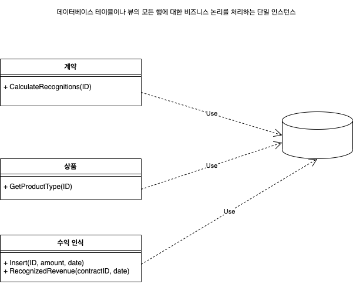
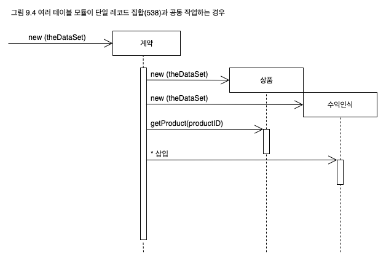
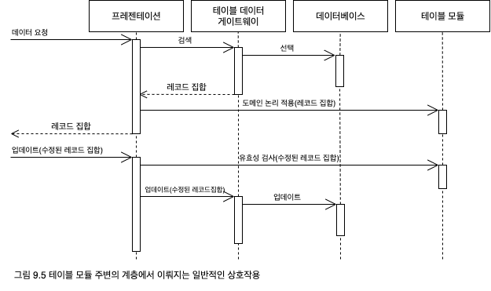
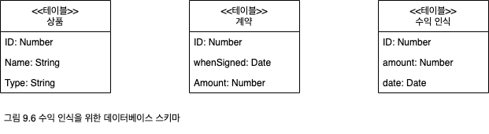

## 테이블 모듈
데이터베이스 테이블이나 뷰의 모든 행에 대한 비즈니스 논리를 처리하는 단일 인스턴스
<p align="center">
  
</p>

객체지향의 핵심 개념 중 하나는 데이터, 그리고 이를 사용하는 동작을 하나로 묶는 것이다. 기존의 객체지향 방식은 [도메인 모델](https://github.com/wonder13662/pattern-of-enterprise-application-architecture/tree/main/pattern/domain-model)과 비슷한 맥락으로 식별자가 있는 객체에 기반을 두고 있다. 예를 들어, 직원이라는 클래스가 있을 때 이 클래스의 한 인스턴스는 특정한 직원에 해당한다. 이 체계는 한 직원에 대한 참조가 있으면 이 직원을 대상으로 작업 실행, 관계 확인, 데이터 수집 등을 수행할 수 있으므로 이해하기 쉽고 잘 동작한다.

[도메인 모델](https://github.com/wonder13662/pattern-of-enterprise-application-architecture/tree/main/pattern/domain-model)의 문제점 중 하나는 관계형 데이터베이스와의 인터페이스가 까다롭다는 것이다. 이 방식은 어떻게 보면 관계형 데이터베이스를 다락방에 혼자 지내며 아무하고도 대화하지 않는 미친 숙모처럼 취급한다고 할 수 있다. 이 때문에 데이터베이스와 데이터를 주고받은 작업이나, 데이터의 두 가지 다른 표현 사이를 변환하는 기본적인 작업에도 적지 않은 프로그래밍 노력이 필요하다.

테이블 모듈(Table Module)은 데이터베이스의 테이블당 클래스 하나로 도메인 논리를 구성하며, 클래스의 한 인스턴스가 해당 데이터에 대해 수행하는 여러 프로시저를 포함한다. [도메인 모델](https://github.com/wonder13662/pattern-of-enterprise-application-architecture/tree/main/pattern/domain-model)과의 가장 큰 차이점은 주문이 여러 개인 경우 [도메인 모델](https://github.com/wonder13662/pattern-of-enterprise-application-architecture/tree/main/pattern/domain-model)은 주문의 수만큼 객체를 사용하지만, 테이블 모듈은 모든 주문을 객체 하나가 처리한다는 것이다.

### 작동 원리

테이블 모듈의 장점은 데이터와 동작을 하나로 묶으면서도 동시에 관계형 데이터베이스의 강력함을 그대로 활용할 수 있다는 것이다. 테이블 모듈은 표면적으로 보통 객체와 아주 비슷하다. 핵심적인 차이는 작업 대상 객체의 식별자 개념이 없다는 것이다. 따라서 직원의 주소를 얻으려면 anEmployeeModule.getAddress(long employeeID)와 비슷한 메서드를 사용해야 한다. 특정 직원에 대한 어떤 작업을 할 때마다 항상 일종의 식별자 참조를 전달해야 한다. 이 식별자는 데이터베이스에 사용되는 기본 키인 경우가 많다.

테이블 모듈은 테이블 기반의 기본 자료구조와 함께 사용하는 것이 일반적이다. 이 테이블 형식 데이터는 일반적으로 SQL 호출의 결과이며, SQL 테이블을 흉내내는 [레코드 집합]()에 저장된다. 테이블 모듈은 이 데이터를 대상으로 작업하는 명시적인 메서드 기반 인터페이스를 제공한다. 동작을 테이블과 함께 그룹화함으로써 동작과 이 동작의 대상이 되는 데이터를 하나로 묶는 캡슐화의 여러 장점을 제공할 수 있게 됐다.

유용한 작업을 하려면 여러 테이블 모듈의 동작이 필요한 경우가 많다. 그림 9.4와 같이 여러 테이블 모듈이 동일한 [레코드 집합]()을 대상으로 작업하는 경우를 자주 볼 수 있다.

테이블 모듈의 가장 전형적인 예는 데이터베이스의 각 테이블당 하나씩 테이블 모듈을 사용하는 것이다. 그러나 데이터베이스에 흥미로운 쿼리와 뷰가 있는 경우 이에 대한 테이블 모듈도 사용할 수 있다.

<p align="center">
  
</p>

테이블 모듈은 인스턴스 하나이거나 정적 메서드의 컬렉션일 수 있다. 테이블 모듈이 인스턴스 하나인 경우 기존의 레코드 집합(쿼리의 결과일 수 있음)으로 테이블 모듈을 초기화할 수 있다는 장점이 있다. 그런 다음 이 인스턴스를 사용해 레코드 집합의 행을 조작할 수 있다. 또한 인스턴스일 때는 상속을 적용할 수 있으므로, 예를 들어 일반 계약에 추가 동작을 더해 긴급 계약 모듈을 작성하는 등의 작업이 가능하다.

테이블 모듈은 쿼리를 팩터리 메서드로 포함할 수 있다. 다른 방법은 [테이블 데이터 게이트웨이]()를 사용하는 것이지만, 이 경우 설계 안에 추가적인 [테이블 데이터 게이트웨이]() 클래스와 매커니즘이 포함되는 것이 단점이다. 장점은 각 데이터 원본에 다른 [테이블 데이터 게이트웨이]()를 사용하므로 테이블 모듈 하나를 다른 데이터 원본의 데이터에 사용할 수 있다는 것이다.

[테이블 데이터 게이트웨이]()를 사용하는 경우 애플리케이션은 먼저 [테이블 데이터 게이트웨이]()를 사용해 데이터로 [레코드 집합]()을 조립한다. 그런 다음 [레코드 집합]()을 인수로 이용해 테이블 모듈을 만든다. 여러 테이블 모듈의 동작이 필요한 경우 동일한 [레코드 집합]()을 사용해 테이블 모듈을 만들 수 있다. 그런 다음 테이블 모듈은 [레코드 집합]()을 대상으로 비즈니스 논리를 수행한 다음 수정된 [레코드 집합]()을 표시하고 테이블 인식 위젯을 사용해 편집할 수 있게 프레젠테이션으로 전달한다. 위젯은 레코드 집합이 관계형 데이터베이스에서 곧바로 가져온 것인지, 아니면 테이블 모듈이 중간에 데이터를 조작한 것인지 구분할 수 없다. GUI에서 수정된 데이터는 다시 테이블 모듈로 전달된 후 유효성 검사를 거쳐 데이터베이스에 저장된다. 이 방식의 장점은 메모리에 [레코드 집합]()을 생성해 데이터베이스를 거치지 않고도 테이블 모듈을 테스트할 수 있다는 것이다.

<p align="center">
  
</p>

테이블 모듈아리는 이름에서 "테이블"은 데이터베이스의 테이블당 테이블 모듈이 하나씩 사용된다는 의미가 있다. 어느 정도는 사실이지만 항상 그렇지만은 않다. 일반적으로 사용되는 뷰나 다른 쿼리에 대한 테이블 모듈을 만들어도 유용하다. 실제로 테이블 모듈의 구조는 데이터베이스의 테이블 구조보다는 애플리케이션이 인식되는 뷰와 쿼리를 포함한 가상의 테이블에 더 가깝다.

### 사용시점

테이블 모듈은 그 이름이 나타내는 것처럼 [레코드 집합]()을 사용해 테이블 형식의 데이터에 접근할 때 가장 적합한 패턴이다. 또한 자료구조를 코드에서 가장 중요한 요소로 다루므로 자료구조에 직관적으로 접근할 수 있다.

그러나 테이블 모듈은 복잡한 논리를 구성하는 객체의 강력함을 완전하게 활용하지는 못한다. 직접적인 인스턴스-인스턴스 관계를 만들 수 없고, 다형성이 제대로 작동하지 않는다. 따라서 복잡한 도메인 논리를 처리해야 한다면 [도메인 모델](https://github.com/wonder13662/pattern-of-enterprise-application-architecture/tree/main/pattern/domain-model)을 선택하는 것이 좋다. 말하자면 테이블 모듈은 복잡한 논리를 처리하는 [도메인 모델](https://github.com/wonder13662/pattern-of-enterprise-application-architecture/tree/main/pattern/domain-model)의 능력 대신에 테이블 기반 자료구조와의 손쉬운 통합 능력을 맞바꾼 패턴이다.

[도메인 모델](https://github.com/wonder13662/pattern-of-enterprise-application-architecture/tree/main/pattern/domain-model)의 객체와 데이터베이스 테이블이 상대적으로 비슷하다면 [활성 레코드]()를 사용하는 도메인 모델을 사용하는 것이 나을 수 있다. 또한 애플리케이션의 다른 부분이 일반적인 테이블 기반 자료구조에 바탕을 두고 있다면 [도메인 모델](https://github.com/wonder13662/pattern-of-enterprise-application-architecture/tree/main/pattern/domain-model)과 [활성 레코드]()의 조합보다 테이블 모듈이 더 잘 어울린다. 자바 환경에서 테이블 모듈을 자주 볼 수 없는 것은 바로 이 때문이다. 물론 행 집합이 널리 보급되면 이런 상황은 달라질 수 있다.

이 패턴을 활용하는 데 가장 적합한 환경으로 마이크로소프트 .NET 환경이 있다. .NET(그리고 COM) 환경에서는 [레코드 집합]()이 애플리케이션의 주요 데이터 리포지토리로 사용된다. 레코드 집합을 UI로 전달하면 데이터 인식 위젯으로 정보를 표시할 수 있다. 또한 마이크로소프트 ADO 라이브러리는 관계형 데이터를 레코드 집합으로 접근할 수 있는 훌륭한 매커니즘을 제공한다. 이러한 환경이라면 애플리케이션에서 테이블 모듈을 사용해 비즈니스 논리를 체계적인 방법으로 구현하고 테이블 형식 데이터에서 작동하는 다양한 요소의 기능을 최대한 활용할 수 있다.

### 예제: 테이블 모듈을 이용한 수익 인식(C#)

다른 도메인 모델링 패턴에서 사용했던 [수익 인식 예제]()에 이번에는 테이블 모듈을 적용해 보겠다. 기억을 되살리자면, 이 예제의 목표는 상품의 종류에 따라 다양한 규칙이 적용되는 주문의 수익을 인식하는 것이다. 이 예제에서는 세 가지 상품(워드프로세서, 스프레드시트, 데이터베이스)에 각기 다른 규칙을 적용한다.

테이블 모듈은 일반적으로 관계형 데이터 모델인 일종의 데이터 스키마에 기반을 둔다(향후에는 XML 모델을 비슷한 방법으로 사용할 수 있다.) 이 예에서는 그림 9.6의 관계형 스키마를 사용한다.

이 데이터를 조작하는 클래스는 거의 같은 형태이며, 각 테이블당 테이블 모듈 클래스가 하나씩 사용된다. .NET 아키텍처의 데이터 집합 객체는 데이터베이스의 구조의 인메모리 표현을 제공한다. 따라서 이 데이터 집합을 이용하도록 클래스를 구축하는 것이 합리적이다. 각 테이블 모듈 클래스에는 데이터 집합 내의 테이블 하나에 해당하는 .NET 시스템 클래스인 데이터 테이블 형식의 데이터 멤버가 표현된다. 테이블을 읽는 이 같은 능력은 모든 테이블 모듈에 공통적이므로 [계층 상위 형식]()에 나올 수 있다.

```csharp
class TableModule {
  protected DataTable table;
  protected TableModule(DataSet ds, String tableName) {
    table = ds.Tables[tableName];
  }
}
```

하위 클래스 생성자는 올바른 테이블 이름과 함께 상위 클래스 생성자를 호출한다.

```csharp
class Contract {
  public Contract(DataSet ds):base(ds, "Contracts") {}
}
```

<p align="center">
  
</p>

이렇게 하면 데이터 집합 하나를 테이블 모듈의 생성자로 전달하는 방법으로 새 테이블 모듈을 생성할 수 있다.

```csharp
  contract = new Contract(dataset);
```

이것은 ADO.NET의 가이드라인에 따라 데이터 집합을 생성하는 코드를 테이블 모듈로부터 분리하기 위한 것이다.

C# 인덱서는 데이터 테이블에서 기본 키로 지정한 특정 행을 가져오는 유용한 기능이다.

```csharp
class Contract{
  public DataRow this [long key] {
    get {
      String filter = String.Format("ID = {0}", key);
      return table.Select(filter)[0];
    }
  }
}
```

예제의 앞부분에서는 먼저 계약의 수익 인식을 계산하고 수익 인식 테이블을 적절하게 업데이트한다. 인식된 총액은 상품의 종류에 따라 달라진다. 이 동작은 계약 테이블의 데이터를 주로 사용하므로 이 메서드는 계약 클래스에 추가했다.

```csharp
class Contract {
  public void CalculateRecognitions (long contractID) {
    DataRow contractRow = this[contractID];
    Decimal amount = (Decimal)contractRow["amount"];
    RevenueRecognition rr = new RevenueRecognition(table.DataSet);
    Product prod = new Product(table.DataSet);
    long prodID = GetProductId(contractID);
    if (prod.GetProductType(prodID) == ProductType.WP) {
      rr.Insert(contractID, amount, (DateTime) GetWhenSigned(contractID));
    } else if (prod.GetProductType(prodID) == ProductType.SS) {
      Decimal[] allocation = allocate(amount, 3);
      rr.Insert(contractID, allocation[0], (DateTime) GetWhenSigned(contractID));
      rr.Insert(contractID, allocation[1], (DateTime) GetWhenSigned(contractID).AddDays(60));
      rr.Insert(contractID, allocation[2], (DateTime) GetWhenSigned(contractID).AddDays(90));
    } else if (prod.GetProductType(prodID) == ProductType.DB) {
      Decimal[] allocation = allocate(amount, 3);
      rr.Insert(contractID, allocation[0], (DateTime) GetWhenSigned(contractID));
      rr.Insert(contractID, allocation[1], (DateTime) GetWhenSigned(contractID).AddDays(30));
      rr.Insert(contractID, allocation[2], (DateTime) GetWhenSigned(contractID).AddDays(60));
    } else throw new Exception("invalid product id");
  }

  private Decimal[] allocate(Decimal amount, int by) {
    Decimal lowResult = amount / by;
    lowResult = Decimal.Round(lowResult, 2);
    Decimal highResult = lowResult + 0.01m;
    Decimal[] results = new Decimal[by];
    int remainder = (int) amount % by;
    for (int i = 0; i < remainder; i++) results[i] = highResult;
    for (int i = remainder; i < by; i++) results[i] = lowResult;
    return results;
  }
}
```

이러한 경우 일반적으로 필자는 [금액]()을 사용하지만 여기서는 다양한 방법을 보여주기 위해 decimal을 사용했다. 그리고 [금액]()에 사용하는 것과 비슷한 할당 메서드를 사용했다. 이 작업을 하려면 다른 클래스에 정의된 동작이 필요하다. 우선 상품은 자신이 어떤 종류인지 알려줄 수 있어야 한다. 이를 위해 상품 종류를 나타내는 열거형과 조회 메서드를 만든다.

이 작업을 하려면 다른 클래스에 정의된 동작이 필요하다. 우선 상품은 자신이 어떤 종류인지 알려줄 수 있어야 한다. 이를 위해 상품 종류를 나타내는 열거형과 조회 메서드를 만든다.

```csharp
  public enum ProductType {WP, SS, DB};

class Product {
  public ProductType GetProductType (long id) {
    String typeCode = (String) this[id]["type"];
    return (ProductType) Enum.Parse(typeof(ProductType), typeCode);
  }
}
```

GetProductType은 이 정보를 데이터 테이블에 캡슐화한다. 앞서 계약 클래스에서는 총액에 직접 접근했지만, 이번에는 데이터의 모든 열에 대해 이 작업을 할 수 있도록 인수를 받았다. 캡슐화는 일반적으로 좋은 것이지만, 시스템의 다른 부분이 데이터 집합에 직접 접근하는 환경이라는 가정에는 맞지 않으므로 여기서는 캡슐화하지 않았다. 데이터 집합이 UI로 전달될 때는 캡슐화가 적용되지 않으므로 열 접근 함수는 문자열을 상품의 종류로 변환하는 등의 추가 기능을 수행해야 할 때만 의미가 있다.

필자는 여러 플랫폼에서 좀 더 일반적인, 형식 없는 데이터 집합을 사용했지만, [.NET에서는 엄격한 형식의 데이터 집합을 사용해야 한다는 주장 - 539p]()에도 설득력이 있다는 것을 알아두자.

다른 추가 동작은 새로운 수익 인식 레코드의 집합이다.

```csharp
class RevenueRecognition {
  public long Insert (long contractID, Decimal amount, DateTime date) {
    DataRow newRow = table.NewRow();
    long id = GetNextID();
    newRow["ID"] = id;
    newRow["contractID"] = contractID;
    newRow["amount"] = amount;
    newRow["date"] = String.Format("{0:s}", date);
    table.Rows.Add(newRow);
    return id;
  }
}
```

이 메서드 역시 데이터 행의 캡슐화가 목적이 아니라 여러 행의 코드 반복 대신 메서드를 사용하기 위한 것이다.

예제의 뒷부분에서는 계약에서 지정한 날까지 인식된 모든 수익의 합계를 얻는다. 이 코드에서는 수익 인식 테이블을 사용하므로 여기에 메서드를 정의하는 것이 합리적이다.

```csharp
class RevenueRecognition {
  public Decimal RecognizedRevenue (long contractID, DateTime asOf) {
    String filter = String.format("ContractID = {0} AND date <= #{1:d}#", contractID, asOf);
    DataRow[] rows = table.Select(filter);
    foreach (DataRow row in rows) {
      result += (Decimal)row["amount"];
    }
    return result;
  }
}
```

이 코드에서는 where 절을 정의해 조작할 데이터 테이블의 부분 집합을 선택하는 ADO.NET의 아주 유용한 기능을 활용하고 있다. 여기서 더 나아가 집계함수를 사용할 수도 있다.

```csharp
class RevenueRecognition {
  public Decimal RecognizedRevenue2 (long contractID, DateTime asOf) {
    String filter = String.format("ContractID = {0} AND date <= #{1:d}#", contractID, asOf);
    String computedExpression = "sum(amount)";
    Object sum = table.Compute(computeExpression, filter);
    return (sum is System.DBNull)? 0 : (Decimal) sum;
  }
}
```
